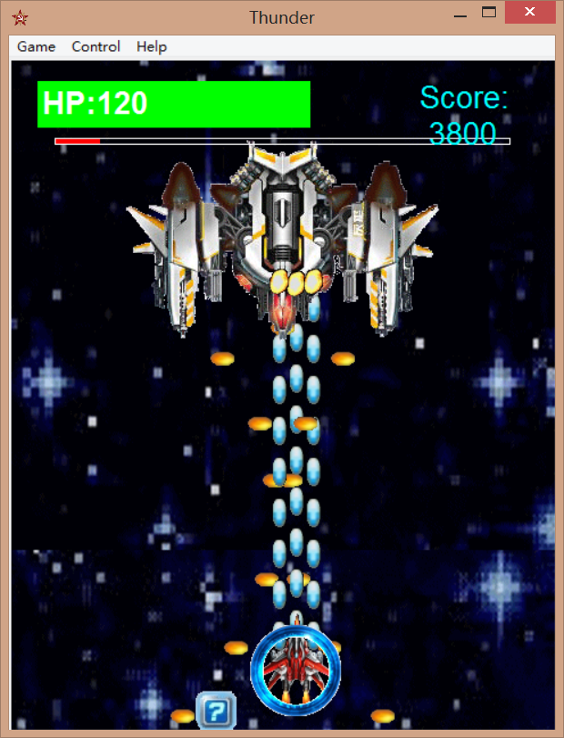
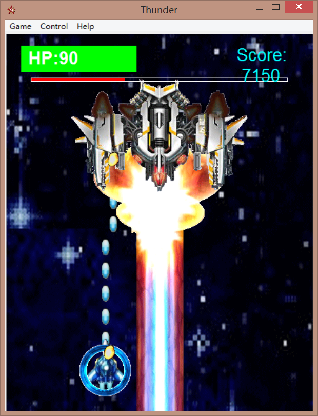

# Thunder
This is a 2D shooting game coded with Python

Keyboard preferences can be adjusted by users

The score board will automatically record the 5 highest scores along with names of the players

The background and the fighter plane can be switched by users

## Default keyboard settings:
- `W/A/S/D` move
- `Num1` Change Background
- `Num2` Change Plane
- `F1` Pause
- `F2` Restart
- `F3` Keyboard Settings
- `F4` Keyboard Preferences Reset
- `F9` Introductions
- `F10` Tutorial
- `F11` Highest Scores
- `F12` Exit Game

## Screenshots
<figure class="half">
    
    
</figure>
